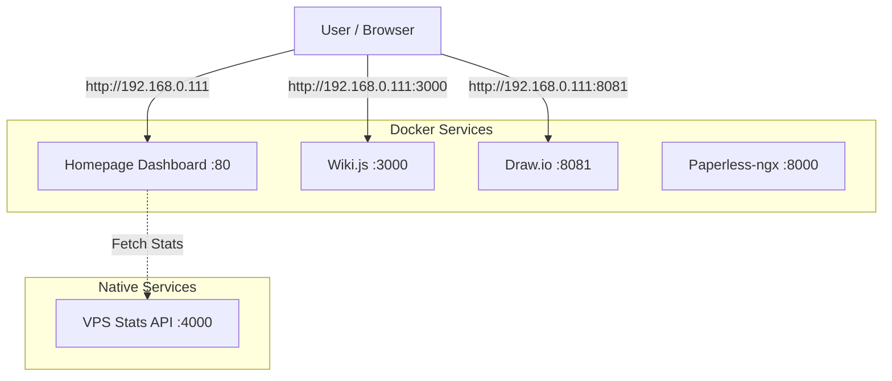

# Linux VM Overview

**System:** Debian 13 "Trixie"
**IP Address:** 192.168.0.111
**Role:** Central Application Server
**Status:** Online

---

## System Architecture

This Virtual Machine acts as a centralized host for self-hosted services, managed via **Docker Compose**.



**VPN Zugriff:** Via Tailscale/Headscale ist Homepage auch unter `http://home.lab` erreichbar.

---

## Hosted Services

| Service | Port | URL | Type | Status |
|:---|:---|:---|:---|:---|
| **Homepage** | :80 | `http://192.168.0.111` / `http://home.lab` | Docker | Active |
| **Wiki.js** | :3000 | `http://192.168.0.111:3000` | Docker | Active |
| **Draw.io** | :8081 | `http://192.168.0.111:8081` | Docker | Active |
| **VPS Stats API** | :4000 | `localhost:4000/stats` | Native (Bun) | Active |
| **Paperless** | :8000 | *(Config dependent)* | Docker | Setup |
| **Apache** | - | - | Native (Systemd) | Disabled |

---

## Service Details

### 1. Homepage Dashboard
The main landing page. It connects to the **VPS Stats API** to display real-time system metrics (CPU, RAM, Disk).
- **Port:** 80 (mapped to container port 3000)
- **Directory:** `~/homepage`
- **Config:** `~/homepage/config/services.yaml`
- **Documentation:** [Homepage Setup](../services/homepage-dashboard-setup.md)

### 2. Wiki.js
Documentation platform for storing system knowledge and guides.
- **Port:** 3000
- **Directory:** `~/wikiJS`
- **Features:** Git Sync (Backup to GitHub), Markdown support.
- **Documentation:** [Wiki.js Setup](../services/wikijs-setup.md)

### 3. Draw.io
Self-hosted Diagramm-Editor für Netzwerk-Diagramme, Flowcharts, etc.
- **Port:** 8081 (HTTP), 8443 (HTTPS)
- **URL:** `http://192.168.0.111:8081`
- **Image:** `jgraph/drawio`

### 5. VPS Stats API
A lightweight custom API built with **Bun** to provide system metrics to the Homepage dashboard.
- **Port:** 4000
- **Directory:** `~/vps-stats-api`
- **Technology:** TypeScript / Bun
- **Endpoint:** `GET /stats`
- **Documentation:** [Stats API](../services/stats-api.md)

### 6. Paperless-ngx
Document management system for archiving scanned documents.
- **Port:** 8000
- **Directory:** `/opt/paperless` (or `~/paperless`)
- **Key Features:** OCR, Tagging, Full-text search.
- **Documentation:** [Paperless-ngx](../services/paperless-ngx.md)

### 7. Apache (Disabled)
Apache ist installiert aber deaktiviert. Kann bei Bedarf als Reverse Proxy aktiviert werden.
- **Config Path:** `/etc/apache2/sites-available/`
- **Status:** Disabled (syntax error in config)

---

## Management & Maintenance

### Docker Management
```bash
# View all running containers
docker ps --format "table {{.ID}}\t{{.Names}}\t{{.Status}}\t{{.Ports}}"

# Update Homepage
cd ~/homepage && docker compose pull && docker compose up -d

# Update Wiki.js
cd ~/wikiJS && docker compose pull && docker compose up -d
```

### System Updates
```bash
sudo apt update && sudo apt upgrade -y
```

### VPS Stats API Control
```bash
# Check if running
lsof -i :4000

# Start manually (if not in systemd)
cd ~/vps-stats-api
bun install
bun index.ts
```

---

## Directory Map

```text
/root/
├── homepage/              # Homepage Dashboard Docker configs
├── wikiJS/                # Wiki.js Docker configs & data
├── vps-stats-api/         # Custom Stats API source code
└── ...
```

---

*Letzte Aktualisierung: Januar 2026*
