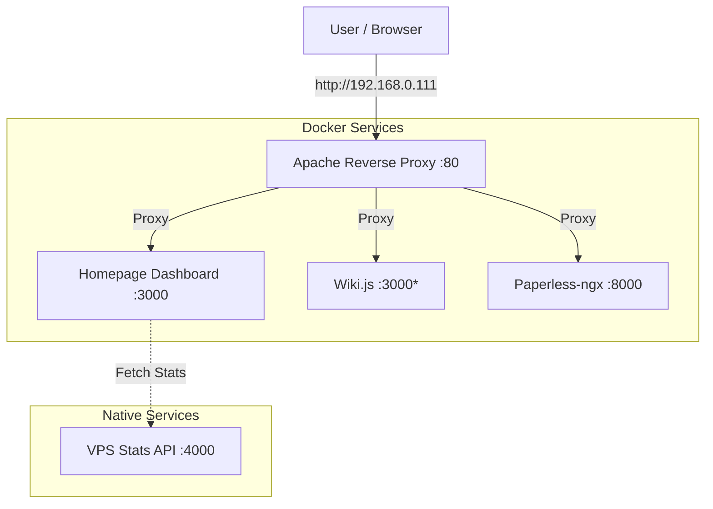

# 🐧 Linux VM Overview

**System:** Debian 13 "Trixie"  
**IP Address:** 192.168.0.111  
**Role:** Central Application Server & Reverse Proxy  
**Status:** 🟢 Online

---

## 🗺️ System Architecture

This Virtual Machine acts as a centralized host for self-hosted services, managed via **Docker Compose** and accessible through an **Apache Reverse Proxy**.



*> ⚠️ **Note on Ports:** Ensure distinct host ports are assigned if services (like Homepage and Wiki.js) default to the same port (e.g., 3000).*

---

## 📦 Hosted Services

| Service | Internal Port | URL (via Proxy) | Type | Status |
|:---|:---|:---|:---|:---|
| **Apache** | :80 | `http://192.168.0.111` | Native (Systemd) | 🟢 Active |
| **Homepage** | :3000 | `http://192.168.0.111` | Docker | 🟢 Active |
| **VPS Stats API**| :4000 | `localhost:4000/stats` | Native (Bun) | 🟢 Active |
| **Wiki.js** | :3000* | *(Config dependent)* | Docker | 🟡 Setup |
| **Paperless** | :8000 | *(Config dependent)* | Docker | 🟡 Setup |

---

## 🔧 Service Details

### 1. 🌐 Apache Reverse Proxy
The gateway to all services. Handles incoming traffic and routes it to the correct Docker container or local port.
- **Config Path:** `/etc/apache2/sites-available/`
- **Important Command:** `sudo systemctl reload apache2`
- **Documentation:** [Apache Setup](../services/apache-reverse-proxy-setup.md)

### 2. 🏠 Homepage Dashboard
The main landing page. It connects to the **VPS Stats API** to display real-time system metrics (CPU, RAM, Disk).
- **Directory:** `~/homepage`
- **Config:** `~/homepage/config/services.yaml`
- **Documentation:** [Homepage Setup](../services/homepage-dashboard-setup.md)

### 3. 📊 VPS Stats API
A lightweight custom API built with **Bun** to provide system metrics to the Homepage dashboard.
- **Directory:** `~/vps-stats-api`
- **Technology:** TypeScript / Bun
- **Endpoint:** `GET /stats`
- **Running:** via `nohup` or Systemd service
- **Source Code:** `index.ts`

### 4. 📚 Wiki.js
Documentation platform for storing system knowledge and guides.
- **Directory:** `~/wikiJS`
- **Features:** Git Sync (Backup to GitHub), Markdown support.
- **Documentation:** [Wiki.js Setup](../services/wikijs-setup.md)

### 5. 📄 Paperless-ngx
Document management system for archiving scanned documents.
- **Directory:** `/opt/paperless` (or `~/paperless`)
- **Key Features:** OCR, Tagging, Full-text search.
- **Documentation:** [Paperless-ngx](../services/paperless-ngx.md)

---

## 🛠️ Management & Maintenance

### Docker Management
```bash
# Update all containers in a directory
cd ~/homepage && docker compose pull && docker compose up -d

# View all running containers
docker ps --format "table {{.ID}}\t{{.Names}}\t{{.Status}}\t{{.Ports}}"
```

### System Updates
```bash
sudo apt update && sudo apt upgrade -y
```

### VPS Stats API Control
```bash
# Check if running
lsof -i :4000

# Start manually (if not in systemd)
cd ~/vps-stats-api
bun install
bun index.ts
```

---

## 📂 Directory Map

```text
/home/zabooz/
├── homepage/              # Homepage Dashboard Docker configs
├── wikiJS/               # Wiki.js Docker configs & data
├── vps-stats-api/        # Custom Stats API source code
└── ...
```
